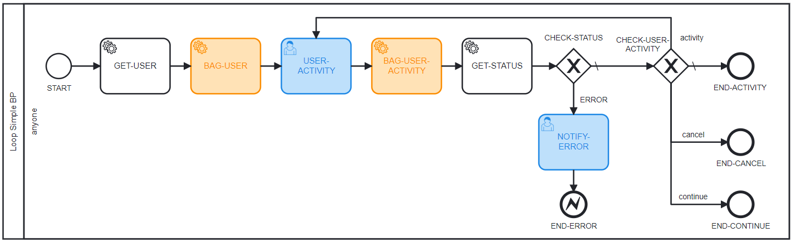

# blueprints-tests-mapper
blueprints-tests-mapper is a plugin to get all possible paths of a given process 
blueprint.

## Installation
```
npm install blueprints-tests-mapper
```

## Usage
You can use this plugin to get the paths ignoring or not the present loops, as 
follows. 

```js
// ignoring loops - add 'true' as the second argument of function 'getAllPaths'
const { getAllPaths } = require('blueprints-tests-mapper');
const allPaths = getAllPaths(blueprint, true);

// counting paths with loops - just pass the first argument (false is the default 
// for the second argument)
const { getAllPaths } = require('blueprints-tests-mapper');
const allPaths = getAllPaths(blueprint);

/*
note that 'blueprint' must be a valid blueprint inside flowbuild's pattern, i.e, 
must have the valid properties 'name', 'description' and 'blueprint_spec' in it.
*/
```

## Tested Blueprints Patterns (Diagrams Images)

### Number of paths: 1


### Number of paths: 2


### Number of paths: 4


### Number of paths: 6 (Counting loop) / 3 (Ignoring loop)


### Number of paths: 8 (Counting loop) / 6 (Ignoring loop)


### Number of paths: 9 (Counting loop) / 5 (Ignoring loop)


### Number of paths: 60 (Counting loop) / 5 (Ignoring loop)
